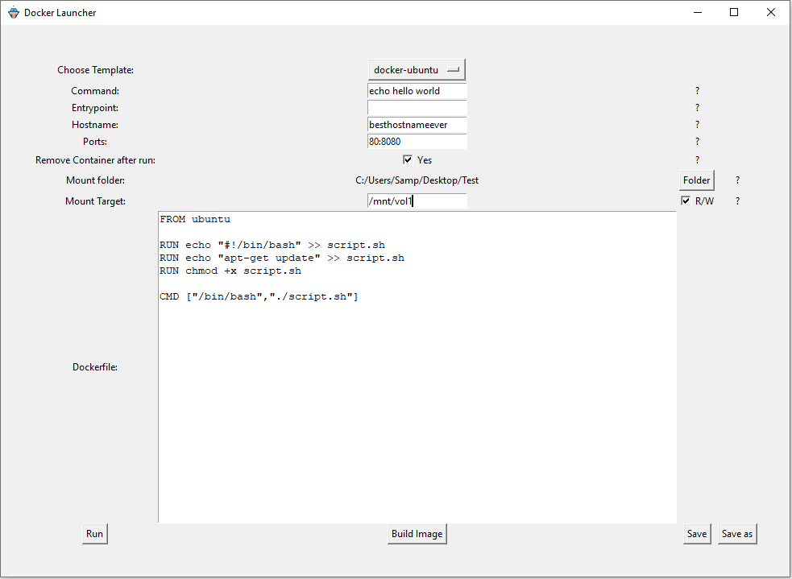

# docker-launcher
Small GUI Application to launch default and customized docker container

This is a small python project I created in order to get a GUI for launching and creating Dockerfiles. 
The project comes with a few basic examples which can be used to create an image and launch the container. Those Dockerfiles can be edited and new ones can be created. 
The GUI has options analog the docker run command.

**Commands**

- --hostname
- --port
- --detach
- --entrypoint
- --volume
- --rm

**Limitations**

- Be carefull with the Command and Entrypoint command. I just checked it with simple "echo hello world" and nothing more sophisticated. You might encounter problems depending what you input here.
- This script has a general error message if the container run fails. Problems within the Dockerfile and wrong parameters are all cause the same error, therefore it is not always easy to find a fix
- The image you create from a Dockerfile has the same name as the file. You cannot specify any version number. If you want to create an image with a different name, you have to store the file with a different name
- The dropdown menu is not updating. In order to see newly generated templates you have do reopen the programm.
- This script has no output for any Docker logs. Inside the CMD Line or IDE you can see the output of a new image made, but a container run throws no output. You just get the information whether the run was successfull or not.
- Not eye catching! Yes I know, this GUI is ugly af. But being no Frontend Developer and rather interested it something running instead of something good looking, I didn't dive deeper into tkinter to create something with a bit more bauty.
